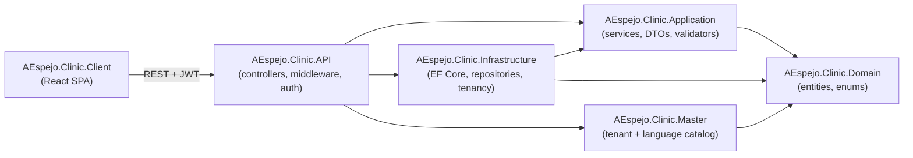

# 🦷 AEspejo.Clinic

> Multi-tenant SaaS platform for dental clinics — each client company (tenant) gets its own database, while a shared master database holds the tenant catalog and the supported-languages catalog.

[](https://github.com/alvaroespejo-dev/clinic-management-demo/actions/workflows/ci.yml)


**🌐 Live demo** — App: <https://blue-forest-0df195910.7.azurestaticapps.net> · API: <https://clinicdemoapi-accybtbjdfcvcce4.canadacentral-01.azurewebsites.net> · Login: `admin@demo.local` / `Admin12345`

---

## 📖 Overview

**AEspejo.Clinic** is a management system for dental clinics built as a **multi-tenant SaaS**. Every clinic
company is a *tenant* with a **dedicated database** (data isolation by design), resolved per request from the
request's subdomain (e.g. `demo.localhost`) or an `X-Tenant` header. A separate **master database** keeps the
catalog of tenants (each pointing to its own connection string) and the catalog of supported UI languages.

The backend follows **Clean Architecture** with a **generic CRUD engine**: adding a new manageable entity
rarely requires new infrastructure — you wire it into existing generics across all layers. The React SPA
mirrors this with a single **entity registry** that generates the menu, routes, list pages and forms.

The whole product is **fully internationalized** (English / Spanish) and can run on **SQL Server** (production)
or **SQLite** (a cheap, dependency-free demo — e.g. a portfolio deploy on Azure App Service), selected purely
by configuration.

---

## 📂 Supported Sources (Databases)

The database engine is chosen via configuration (`Database:Provider`) and applies to **both** the master and
every tenant database.

| Source | Provider value | Typical use | Schema strategy |
| --- | --- | --- | --- |
| **SQL Server** | `SqlServer` *(default)* | Production | EF Core **migrations** (`Migrate()`) |
| **SQLite** | `Sqlite` | Cheap demo / local dev (one `.db` file per tenant) | `EnsureCreated()` from the current model |

**Database topology**

| Database | Context | Content | Lives on |
| --- | --- | --- | --- |
| **Master** | `MasterDbContext` | Tenant catalog + supported languages | Always the master DB / file |
| **Tenant** (one per company) | `AppDbContext` | The full clinical model | That company's own DB / file |

> On SQLite each tenant is a separate `.db` file under a data directory (`%HOME%\data` on Azure App Service —
> persistent; `.sqlite-data` locally). See [Database & Multi-tenancy](#-database--multi-tenancy).

---

## ✨ Features

- 🏢 **Multi-tenancy** — database-per-tenant isolation; tenant resolved from subdomain or `X-Tenant` header.
- 🔐 **Authentication & authorization** — JWT bearer tokens, role-based (`Admin`, `Dentist`, `Assistant`, `Receptionist`), passwords hashed with BCrypt.
- 🧩 **Generic CRUD engine** — one base controller/service/repository set drives every entity; the frontend generates pages from a single registry.
- 🦷 **Clinical model** — patients, medical history (allergies & conditions), odontograms & per-tooth records, appointments & details, treatment plans & items.
- 💳 **Billing** — invoices and payments with status tracking (draft / issued / partially paid / paid / cancelled).
- 🗂️ **Service catalog** — per-language translatable services (`ServiceCatalog` + `ServiceCatalogTranslation`).
- 🕵️ **Automatic audit trail** — every create/update/delete is written to an `AuditLog` (read-only through the API).
- ♻️ **Soft delete** — flagged entities are deactivated (`IsActive = false`) instead of physically removed.
- 🌍 **Internationalization** — every user-visible string is an i18n key in **both** `en.json` and `es.json`; enums serialize as strings and are translated.
- 🧾 **Interactive API docs** — OpenAPI document served with **Scalar** UI in development.
- 🌱 **Demo seeding** — a `DevSeeder` provisions a `demo` tenant; SQL scripts seed ~1 month of realistic activity.
- 🧪 **Automated tests** — xUnit + EF Core InMemory suite for Application services.

---

## 🏛 Architecture and Design Patterns Used

Clean / layered architecture with a strict dependency direction:
`Domain ← Application ← Infrastructure / API`. The `Master` project (tenant + language catalog) is independent
of the tenant clinical model.



| Layer | Project | Responsibility |
| --- | --- | --- |
| Domain | `AEspejo.Clinic.Domain` | Entities (`BaseEntity`, `ISoftDeletable`), enums. **No dependencies.** |
| Application | `AEspejo.Clinic.Application` | DTOs, services, `ICrudService<,,>`, validators, Mapster config, `Result<T>`. |
| Infrastructure | `AEspejo.Clinic.Infrastructure` | EF Core (`AppDbContext`), repositories, `AuditInterceptor`, multi-tenancy resolvers, DB provider abstraction. |
| Master | `AEspejo.Clinic.Master` | `MasterDbContext`: tenants + languages, always on the master DB. |
| API | `AEspejo.Clinic.API` | Controllers, `TenantResolutionMiddleware`, JWT auth, DI composition, `DevSeeder`. |
| Client | `AEspejo.Clinic.Client` | React SPA (registry-driven CRUD UI). |

**Patterns & techniques**

- **Clean / Onion Architecture** — dependencies point inward toward the Domain.
- **Repository pattern** — `IRepository<T>`, with a `SoftDeleteRepository<T>` closed registration overriding the open generic for soft-deletable entities.
- **Generic / Template Method CRUD** — `CrudControllerBase` + `CrudServiceBase` / `SoftDeleteCrudServiceBase`; subclasses only add specifics.
- **Result pattern** — `Result<T>` carries success / not-found / validation outcomes instead of throwing.
- **Strategy (provider selection)** — a single `DatabaseProviderExtensions` switches between SQL Server and SQLite.
- **Middleware / Chain of Responsibility** — `TenantResolutionMiddleware` resolves the tenant per request.
- **Interceptor** — `AuditInterceptor` writes audit rows on `SaveChanges` automatically.
- **Object mapping** — **Mapster** flattens navigation properties (`Branch.Name` → `BranchName`).
- **Validation** — **FluentValidation** with a `NoOpValidator<>` fallback.
- **Dependency Injection** — composition in each layer's `DependencyInjection` extension.
- **Registry-driven UI** — the frontend generates menu/routes/pages from one `EntityConfig[]` array.

---

## 🧱 Tech Stack

**Backend** · .NET 10 · ASP.NET Core Web API · EF Core 10 (SQL Server & SQLite providers) · FluentValidation ·
Mapster · BCrypt.Net · JWT Bearer · OpenAPI + Scalar.

**Frontend** · React 19 · Vite 8 · TypeScript 5 · TanStack Query · React Router · react-i18next · Tailwind CSS ·
Axios · oxlint.

**Data** · SQL Server / SQLite · EF Core migrations (SQL Server).

---

## 📋 Requirements

- **.NET 10 SDK**
- **Node.js** 20+ and **npm**
- **SQL Server** (LocalDB, Express, or Azure SQL) — *only if using the SQL Server provider*; **not needed** for the SQLite demo
- (optional) **EF Core tools**: `dotnet tool install --global dotnet-ef`
- (optional) A SQLite browser (e.g. *DB Browser for SQLite*) if you want to inspect `.db` files

---

## 🚀 Getting Started

```bash
git clone https://github.com/alvaroespejo-dev/clinic-management-demo.git
cd clinic-management-demo
dotnet build
```

> **Repository:** `alvaroespejo-dev/clinic-management-demo` · **Default branch:** `main`
> (all pull requests and CI run against `main`).

### Option A — Run on SQLite (zero external dependencies)

The dev environment is preconfigured to use SQLite by default. Just run the API:

```bash
dotnet run --project src/AEspejo.Clinic.API
```

- API: **http://localhost:5287** · API docs (Scalar): **http://localhost:5287/scalar**
- On first run it creates the `.db` files under `src/AEspejo.Clinic.API/.sqlite-data/` and seeds the `demo` tenant.

### Option B — Run on SQL Server

Set the provider back to SQL Server and point the connection string at your instance
(`src/AEspejo.Clinic.API/appsettings.Development.json`):

```jsonc
"Database":  { "Provider": "SqlServer" },
"ConnectionStrings": {
  "MasterConnection": "Data Source=(localdb)\\mssqllocaldb;Initial Catalog=AEspejo_Clinic_Master;Integrated Security=True;TrustServerCertificate=True"
}
```

### Frontend

```bash
cd src/AEspejo.Clinic.Client
npm install
npm run dev          # http://localhost:5173
```

### 🔑 Demo credentials

| Field | Value |
| --- | --- |
| Tenant | `demo` (send as `X-Tenant: demo` header or use the `demo.localhost` subdomain) |
| Email | `admin@demo.local` |
| Password | `Admin12345` |

---

## 🗄️ Database & Multi-tenancy

- A request's tenant is resolved by `TenantResolutionMiddleware` from the **subdomain** or the **`X-Tenant`** header; without a valid tenant → `400`.
- Two `DbContext`s (`MasterDbContext`, `AppDbContext`), each with a design-time factory so `dotnet ef` can create migrations without booting the API.
- A tenant migration is applied to **every** company database.

**Migrations** (SQL Server)

```bash
# Tenant clinical model
dotnet ef migrations add <Name> --project src/AEspejo.Clinic.Infrastructure
# Master DB (tenants + languages)
dotnet ef migrations add <Name> --project src/AEspejo.Clinic.Master
```

**Azure App Service (SQLite demo)** — set these Application Settings:

```
Database__Provider = Sqlite
ConnectionStrings__MasterConnection = Data Source=D:\home\data\master.db
Seed__Enabled = true
```

---

## 🌱 Seeding demo data

- `DevSeeder` provisions a `demo` tenant with admin `admin@demo.local` / `Admin12345` (runs in Development, or whenever `Seed:Enabled=true`).
- Rich “one month of activity” datasets:
  - `scripts/seed-demo-month.sql` — **T-SQL** (SQL Server).
  - `scripts/seed-demo-month.sqlite.sql` — **SQLite** port (honours EF's storage formats: Guid = uppercase TEXT, `DateTimeOffset` = UTC-ticks INTEGER, `DateOnly` = `yyyy-MM-dd`, decimal = TEXT).

---

## 🌐 Internationalization

Every user-visible string goes through i18n. Add the key to **both**
`src/AEspejo.Clinic.Client/src/lib/i18n/locales/en.json` **and** `es.json`, and render it with `t('...')`.
Enums serialize as strings over the API and are translated per value. All source-code comments are in English.

---

## 🧪 Testing

```bash
dotnet test                       # xUnit + EF Core InMemory (Application services)
cd src/AEspejo.Clinic.Client
npm run lint                      # oxlint
npm run build                     # type-check + production build
```

---

## ⚙️ CI/CD & Deployment

Three GitHub Actions workflows automate build, test and deployment to Azure (region: Canada Central).

| Workflow | File | Trigger | Purpose |
| --- | --- | --- | --- |
| **CI** | `ci.yml` | push / PR to `main` | Build + test backend · lint + build frontend |
| **Deploy Backend** | `deploy-backend.yml` | push to `main` (backend paths) · manual | Publish API → Azure **Web App `ClinicDemoApi`** |
| **Deploy Frontend** | `azure-static-web-apps-blue-forest-0df195910.yml` | push / PR to `main` | Build SPA → Azure **Static Web App `ClinicDemoClient`** (PR preview environments) |

**Hosting**

| Tier | Azure resource | OS / Stack | URL |
| --- | --- | --- | --- |
| Backend (API) | App Service `ClinicDemoApi` | Windows · .NET 10 | <https://clinicdemoapi-accybtbjdfcvcce4.canadacentral-01.azurewebsites.net> |
| Frontend (SPA) | Static Web App `ClinicDemoClient` | Free plan | <https://blue-forest-0df195910.7.azurestaticapps.net> |

**Required GitHub secrets**

- `AZUREAPPSERVICE_PUBLISHPROFILE_CLINICDEMOAPI` — App Service publish profile (Portal → *ClinicDemoApi* → **Get publish profile**).
- `AZURE_STATIC_WEB_APPS_API_TOKEN_BLUE_FOREST_0DF195910` — created automatically when the Static Web App was linked to the repo.

**Backend App Settings** (set on `ClinicDemoApi` — production config lives in Azure, not in the repo):

```
Database__Provider = Sqlite
ConnectionStrings__MasterConnection = Data Source=D:\home\data\master.db
Seed__Enabled = true
Jwt__Issuer = AEspejo.Clinic
Jwt__Audience = AEspejo.Clinic.Client
Jwt__SecretKey = <a long random secret, min. 32 chars>
Jwt__ExpiryMinutes = 480
Cors__Origins__0 = https://blue-forest-0df195910.7.azurestaticapps.net
```

**Frontend build variables** (already set in the SWA workflow `env:`): `VITE_API_URL` (the API URL) and
`VITE_TENANT=demo` — the demo is single-tenant and its host subdomain isn't a tenant, so the tenant is forced.

---

## 📁 Project structure

```
clinic-management-demo/
├─ .github/workflows/                 # CI (build/test) + CD (Azure Web App & Static Web App)
├─ src/
│  ├─ AEspejo.Clinic.Domain/          # Entities & enums (no dependencies)
│  ├─ AEspejo.Clinic.Application/     # Services, DTOs, validators, Result<T>, Mapster
│  ├─ AEspejo.Clinic.Infrastructure/  # EF Core, repositories, tenancy, DB provider abstraction
│  ├─ AEspejo.Clinic.Master/          # MasterDbContext (tenants + languages)
│  ├─ AEspejo.Clinic.API/             # Controllers, middleware, auth, DI, DevSeeder
│  └─ AEspejo.Clinic.Client/          # React + Vite + TypeScript SPA
├─ tests/
│  └─ AEspejo.Clinic.Application.Tests/
├─ scripts/                           # SQL seed scripts (SQL Server + SQLite)
└─ docs/requirements/                 # Feature specs (copy TEMPLATE.md per feature)
```

**Domain entities:** Branch · Room · User · Professional · Patient · PatientAllergy · MedicalCondition ·
Odontogram · ToothRecord · ServiceCatalog · ServiceCatalogTranslation · Appointment · AppointmentDetail ·
TreatmentPlan · TreatmentPlanItem · Invoice · Payment · AuditLog · OrgConfig.

---

## 📝 Changelog

### 2026-07 — Deployable portfolio demo

- **Dual database provider (SQL Server + SQLite).** The engine is selected via `Database:Provider`; the whole
  app runs on either, for both the master and every tenant database. A single
  `Infrastructure/Persistence/DatabaseProvider.cs` (`DatabaseProviderExtensions`) centralises provider choice,
  schema strategy (migrations on SQL Server · `EnsureCreated` on SQLite) and the SQLite data directory.
- **SQLite storage compatibility.** A UTC-ticks value converter (applied only under SQLite) makes
  `DateTimeOffset` columns sortable/comparable, so `ORDER BY` in the generic CRUD works on SQLite too.
- **Local & Azure config.** SQLite is the default in Development (`appsettings.Development.json`); a dedicated
  `sqlite` launch profile puts the `.db` files under `src/AEspejo.Clinic.API/.sqlite-data/`; seeding also runs
  when `Seed:Enabled=true` so the non-Development Azure demo still seeds.
- **CI/CD to Azure.** GitHub Actions: `ci.yml` (build + test backend, lint + build frontend),
  `deploy-backend.yml` (→ App Service `ClinicDemoApi`) and `azure-static-web-apps-*.yml`
  (→ Static Web App `ClinicDemoClient`, with PR preview environments).
- **Demo data scripts.** `scripts/seed-demo-month.sql` (T-SQL) and `scripts/seed-demo-month.sqlite.sql`
  (SQLite) seed ~1 month of realistic activity (patients, appointments, invoices, payments, plans).
- **Single-tenant host support.** `VITE_TENANT` build-time override lets the SPA target a fixed tenant on
  hosts whose subdomain isn't a tenant (e.g. the Azure Static Web App URL).
- **UX fix.** The generic CRUD page no longer offers *Edit* for entities that have no editable fields
  (e.g. odontograms), which previously opened an empty dialog; create/delete remain available.
- **i18n hardening.** Remaining hardcoded strings (icon `aria-label`s, the 404 & error pages) were moved to
  i18n keys in both locales, and the `AuditAction` enum group was added.

---

## 🤝 Conventions

1. **All source-code comments in English** (backend and frontend).
2. **No hardcoded user-visible text** — every label/button/toast/message is an i18n key present in both locales.
3. **Reuse the generic CRUD pattern** before writing a bespoke controller/service/page.

Feature specs live in `docs/requirements/` (copy `TEMPLATE.md` per feature). Repo-specific workflows are
documented in `CLAUDE.md` and the `.claude/skills/` directory.
